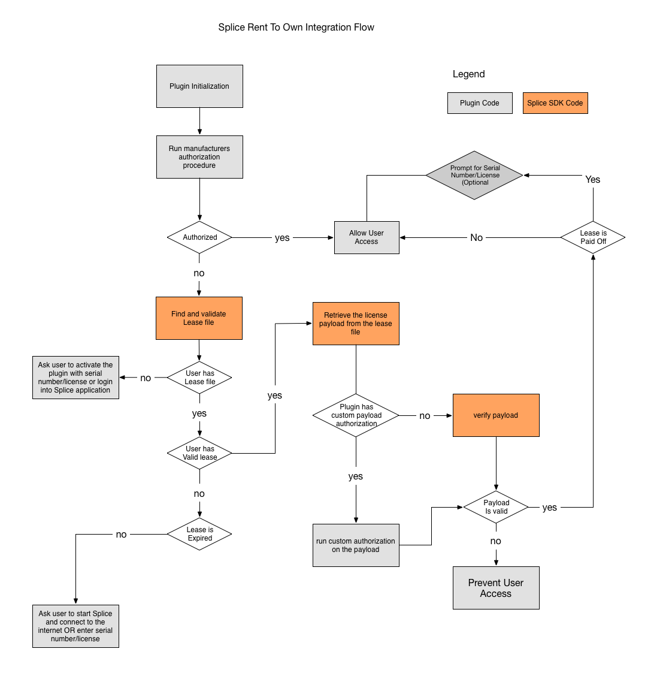

# Splice Rent to Own documentation

Here is some documentation on how to integrate Splice Rent to Own.
This markdown file should be accompanied by a sample code example and tools
compiled for Mac and Windows.

The examples rely on a shared key that must have been provided to you
and is also available in the provided example.

## Authentication logic/flow

When the user first rents a plugin, the Splice client will download a lease
file and store it in a specific location. The lease license file is stored in:

Mac: `~/Library/Application Support/com.splice.Splice/license/<pluginName>.lic`

Windows: `<home>\AppData\Local\SpliceSettings\license\<pluginName>.lic`

This file is managed by the Splice application, it gets refreshed and updated
based on the user's rent status. This file is updated every 12 hours if the user
is online or whenever the user comes back online if that deadline passed. The
information in the file will be valid for 3 days. After that, the user must have
the Splice application running and be connected to the internet.

The Splice SDK is used to read and validate the lease file. The SDK exposes the
lease status (valid/invalid/suspended) and other metadata (user ID in Splice,
username, expiration date). Plugins can use this information to unlock themselves.

The lease file can have a key/serial that can be run against the plugin's
authorization procedure or have a Splice generated payload. If the lease has the
Splice generated payload, the payload will be signed. The SDK provides a function
to validate that the signature on the payload is correct. The plugin can use
this function as an authorization procedure.

It is important to note the distinction between the validity of the lease and
the validity of the key/serial or payload that it contains.

The lease validity will let the plugin know that there’s a valid lease file and
that the user has an active lease on Splice. The key/serial or payload, on the
other hand, will be used to add extra checks. The plugin can run the key/serial
against their authorization procedure or use the Splice SDK to validate the
Splice generated payload and signature.

### Plugin lease file verification flow

At boot time or whenever the plugin developer thinks it's appropriate, the
plugin code should check for the presence of the license file. If the file is
present, it means that the user has or had a Splice rent to own lease.

The file should be loaded in memory and decoded. To do so, a shared key is
exchanged between Splice and the plugin provider. A sample example is provided
to show how to decode the file and release the key/serial number provided to
Splice on behalf of the renter. Alternatively, the file can have a Splice generated
payload. The Splice SDK will provide a validation function for this payload.

The lease license file isn't meant to be a strong crypto protection but instead
a wrapper around an existing licensing scheme used by the plugin provider. The
lease file contains more than the serial key, it contains a list of metadata
allowing us to verify it wasn't tampered and is still valid.

This is some pseudo code trying to explain the basic encryption scheme used:

```
leaseContent = encrypt((encrypt(metadata, key[:24]) + key), sharedKey)
```

The metadata is encrypted using a partial version of the serial/key. Then the
key is appended and the whole is encrypted using the shared key.

The plugin has to recover the key/serial but also the metadata. The metadata is
what's being used to validate that the lease is still valid. Remember that a
lease file is only valid for 3 days.

The metadata contains some information the plugin developer probably doesn't
care about but the 3 values that are really important, the lease status and the
creation and expiration timestamps.

The lease status flag indicates the state of the user "subscription". If the
value is below 0, the user was suspended or is on hold. The user should go on
Splice to fix their payment method or resume the hold. If the value is 0, the
status is unknown (probably a bug) if the status is 1, the lease is active.

The creation timestamp should be checked to make sure the creation hasn't
happened too much in the future of past (careful, users often live in different
timezones and might not have clocks properly set).
The expiration time gives us a buffer, that value only gets updated if the user
is in good standing and if the file was updated by connecting online.
We recommend you add some buffer to avoid false positive.

If the timestamps cleared, then you should verify the key/serial against your own
crypto check or use the Splice SDK to validate the Splice generated payload.



## Tools

To test this process, we provide a set of tools (binaries) and a sample project
in C++. The tools will generate or read a license file.

### generate: License file generator

The generate tool can be found in tools/<platform>. It generates a valid license
file using your shared key. The tool binaries were compiled for mac and for windows.
Launch them from the terminal or command prompt to create and store a license
file. Some params are available to customize the license file.

```
$ darwin/generate -h
Usage of ./generate:
  -plugin string
    	the name of the plugin the license is generated for (default "foo")
  -private-key string
    	the private key for encryption (default "<random private key>")
  -serial string
    	the serial license for the lease (default "fake-license-used-as-an-example")
  -sign boolean
    	whether or not the license should be cryptographically signed (default true)
  -status int
    	lease status <0 issues, 0: unknown, >0: active (default 1)
```

The first time around, just run the executable without any params. A valid license
file will be executed and stored on disk.

The `serial` parameter is useful if the plugin will use its own authorization
procedure. In that case, pass a valid `serial` to the tool.

If you want to use the Splice's validation function, you can decide to `sign` or
not the payload. To turn off signing of the payload, use `-sign=false` as the
parameter. We recommend to keep this on and it is on by default.

### decode: License file verifier

The decode tool can be found in tools/<platform>. It verifies that a license
was generated and stored in the expected place. It also verifies that the
file was encrypted with your shared key.
The tool binaries were compiled for mac and for windows.
Launch them from the terminal or command prompt to verify a license
file. The name of the plugin can be changed via a param.
This is useful if you generated a license file using a custom plugin name.

```
$ darwin/decode -h
Usage of darwin/decode:
  -plugin string
    	the name of the plugin the license is generated for
```

Calling the executable without params, will decode the license using the default
plugin name.

## C++ sample code sample

You should also find a directory called `sample` which contains a C++ sample code.
To test it, you will need to have a valid wrapped license and have it placed in the expected folder.
Use the tools mentioned above to create such a license file.
The demo sample will try to verify the license if it does exist.
You can then use the `splice.h` and `splice.cpp` directly in your project.


### Key/Serial signing and verification

Splice can sign the key/serial with a private key and the SDK provides a way to
verify the signature using a public key. This can be used as an authorization
method. The key/serial is signed using the [Ed25519][ed25519] algorithm.

Splice will provide a private/public key pair. The private key will only be known to Splice.

The SDK makes it possible to turn off the key/serial signing process. Changing
the `SIGN` constant in the `splice.cpp` file will be enough. The generate tool
takes a `sign` flag that indicates if the key/serial will be signed or not. Signing
is turn on by default.

The generate tool can also take a Base64 encoded private key as argument. This can
be useful if you need to sign the key/serial with a different private key. The
public key can be changed in the `splice.cpp` of the SDK.

It is important to mention that the lease validity is different from the key/
serial validity.  The lease validity only indicates that the user has a file
and the SDK could read it, but the key/serial can be validated against the
plugin's custom authorization procedure. The SDK also provides a function to
validate the signature of the payload.

[ed25519]: https://ed25519.cr.yp.to/
